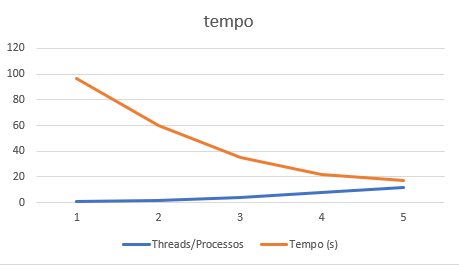
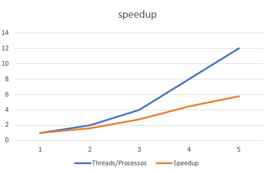
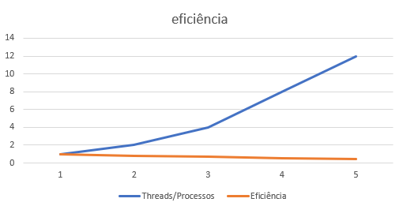

# Relatório da NOME DA ATIVIDADE

**Disciplina:** PROGRAMAÇÃO CONCORRENTE E DISTRIBUÍDA
**Aluno(s):** stevan gutemberg silva serpa 
**Turma:** analise e denvolvimento de sistemas 
**Professor:** rafael
**Data:** 20/03/2026

---

# 1. Descrição do Problema

O problema consiste em processar um grande volume de arquivos de log para extrair informações como quantidade de linhas, palavras, caracteres e contagem de palavras-chave.

O objetivo do programa é realizar esse processamento de forma eficiente, comparando a execução serial com a execução paralela utilizando múltiplos processos.

O algoritmo utilizado percorre todos os arquivos de uma pasta, lê seu conteúdo e realiza contagens básicas. Na versão paralela, os arquivos são distribuídos entre múltiplos processos utilizando a biblioteca multiprocessing com Pool.

O volume de dados utilizado foi de aproximadamente 10 milhões de linhas, distribuídas em diversos arquivos de texto.
---

# 2. Ambiente Experimental

Descreva o ambiente em que os experimentos foram realizados.

## Orientações

Informar as características do hardware e software utilizados na execução dos testes.

| Item                        | Descrição |
| --------------------------- | --------- |
| Processador                 |     intel i5/ ryzen 5      |
| Número de núcleos           |    12       |
| Memória RAM                 |      8 GB     |
| Sistema Operacional         |     Windows      |
| Linguagem utilizada         |    Python       |
| Biblioteca de paralelização |     multiprocessing (Pool)      |
| Compilador / Versão         |      Python 3.13     |

---

# 3. Metodologia de Testes

Os testes foram realizados executando o programa com diferentes quantidades de processos, comparando o tempo de execução entre a versão serial e paralela.

O tempo foi medido utilizando a função time.time(), registrando o início e o fim da execução.

Foi realizada uma execução para cada configuração de processos, utilizando o mesmo conjunto de dados.

Configurações testadas

1 processo (serial)

2 processos

4 processos

8 processos

12 processos

Procedimento experimental

Os testes foram executados em uma máquina pessoal, sem outras aplicações pesadas rodando simultaneamente.
Os tempos foram medidos diretamente durante a execução do programa.

---

# 4. Resultados Experimentais

Preencha a tabela com os **tempos médios de execução** obtidos.

## Orientações

* O tempo deve ser informado em **segundos**
* Utilizar a **média das execuções**

| Nº Threads/Processos | Tempo de Execução (s) |
| -------------------- | --------------------- |
| 1                    |            96.9459           |
| 2                    |             59.9741           |
| 4                    |          34.7359             |
| 8                    |         21.6685               |
| 12                   |         16.8077               |

---

# 5. Cálculo de Speedup e Eficiência

## Fórmulas Utilizadas

### Speedup

```
Speedup(p) = T(1) / T(p)
```

Onde:

* **T(1)** = tempo da execução serial
* **T(p)** = tempo com p threads/processos

### Eficiência

```
Eficiência(p) = Speedup(p) / p
```

Onde:

* **p** = número de threads ou processos

---

# 6. Tabela de Resultados

Preencha a tabela abaixo utilizando os tempos medidos.

| Threads/Processos | Tempo (s) | Speedup | Eficiência |
| ----------------- | --------- | ------- | ---------- |
| 1                 |     96.9459  | 1.0     | 1.0        |
| 2                 |      59.9741     |   1.62        |     0.81      |
| 4                 |    34.7359       |    2.79       |     0.70       |
| 8                 |      21.6685      |  4.47        |     0.56       |
| 12                |       16.8077      |    5.77      |     0.48        |

---

# 7. Gráfico de Tempo de Execução

Construa um gráfico mostrando o **tempo de execução em função do número de threads/processos**.




---

# 8. Gráfico de Speedup

Construa um gráfico mostrando o **speedup obtido**.




---

# 9. Gráfico de Eficiência

Construa um gráfico mostrando a **eficiência da paralelização**.

## Orientações

* Eixo X: número de threads/processos
* Eixo Y: eficiência
* Valores entre 0 e 1

Inserir o gráfico abaixo:



---

# 10. Análise dos Resultados

Os resultados mostram que o speedup foi próximo do ideal nas primeiras configurações, principalmente com 2 processos, onde quase dobrou o desempenho.

A aplicação apresentou boa escalabilidade até cerca de 4 processos. A partir de 8 processos, o ganho de desempenho começou a diminuir.

A eficiência começou a cair de forma mais significativa a partir de 8 processos, indicando perda de aproveitamento dos recursos.

O número de processos (12) provavelmente se aproxima ou ultrapassa o número de núcleos disponíveis, o que gera concorrência entre processos.

Houve overhead de paralelização, causado pela criação e gerenciamento dos processos, além do acesso concorrente ao disco.

Possíveis causas de perda de desempenho:

overhead de criação de processos

competição por CPU

acesso simultâneo ao disco

limitações de memória e cache
---

# 11. Conclusão

O paralelismo trouxe um ganho significativo de desempenho, reduzindo o tempo de execução de aproximadamente 95 segundos para cerca de 17 segundos.

O melhor desempenho foi obtido com 12 processos, porém com menor eficiência.

O programa apresentou boa escalabilidade até certo ponto, mas o aumento excessivo de processos reduziu a eficiência.

De forma geral, o experimento demonstrou na prática os benefícios e limitações do processamento paralelo, evidenciando que o aumento do número de processos nem sempre resulta em ganhos proporcionais.

---
